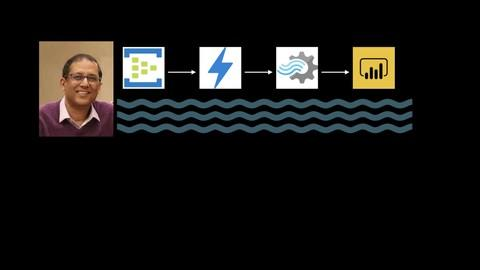

<h4><a href= "http://bit.ly/2sDSyT4">Real Time Stream Processing With Azure, Published on Udemy</a></h4>

In this course, I will give you the insight on thinking of data as an ever flowing river of events instead of thinking of it as a data island locked away in databases. With live labs, I will bring you up to speed with Azure event hubs. I will show you how to write c# console applications to send and receive data from event hubs. You will learn how to capture & archive event hub data to an Azure data lake. I will show you how to provision an Event Hub, a Data Lake and a SQL Server database in azure. You will get a deep understanding of Azure Stream Analytics and we will write an Analytics job  to stream live data from an event hub to a Sql Server database.

