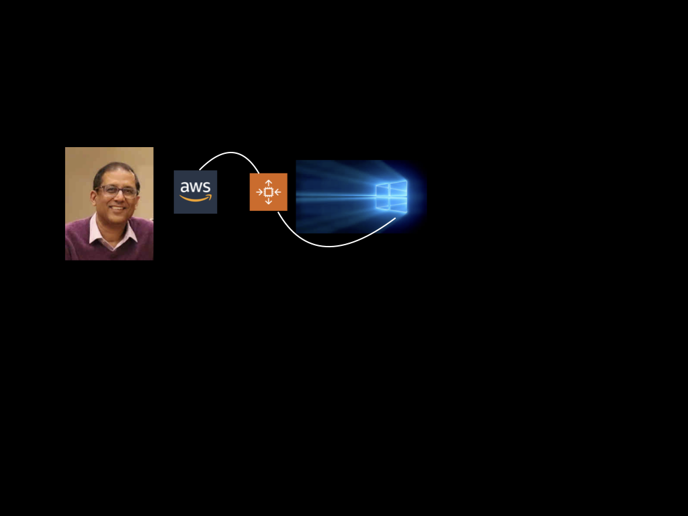

<h4><a href= "https://www.udemy.com/course/aws-windows-workloads-with-code-deploy/?referralCode=88AA7EB652E8C181D892">AWS Windows Workloads With Code Deploy</a> </h4>

In this course, I provide an in depth coverage of intermediate topics like setting up AWS Networking, Load Balancers , Auto Scaling Groups and deploying code using the AWS Code Deploy Service. I will show you how to do all  this on a windows environment on AWS.

The obvious question is why would you run windows workloads on AWS and not Azure? The most important reason is to make yourself invaluable to a plethora of  Public, Financial and Corporations who have invested heavily in AWS. These organization have built their frameworks , architectures and wrapped their own security policies around AWS products, and when it comes to supporting Windows workloads, they would rather stick with AWS than starting with another cloud provider from grounds up. You would be surprised to know that AWS has an even higher market share of Windows than Microsoft. An IDC report shows that AWS’s market share is almost double that of the nearest cloud provider. AWS’s share of the windows market was 57.7 % of the total public Iaas market in 2017. AWS has a full featured suite of Windows Workload products. AWS supports everything you need to build and run Windows applications including Active Directory, .NET, System Center, Microsoft SQL Server, Visual Studio and Windows desktop-as-a-service.

<h4><a href= "https://www.udemy.com/course/real-time-data-stream-processing-in-azure/?referralCode=A6B8A7CC805476478A8B">Real Time Stream Processing With Azure, Published on Udemy </a> </h4>

In this course, I will give you the insight on thinking of data as an ever flowing river of events instead of thinking of it as a data island locked away in databases. With live labs, I will bring you up to speed with Azure event hubs. I will show you how to write c# console applications to send and receive data from event hubs. You will learn how to capture & archive event hub data to an Azure data lake. I will show you how to provision an Event Hub, a Data Lake and a SQL Server database in azure. You will get a deep understanding of Azure Stream Analytics and we will write an Analytics job  to stream live data from an event hub to a Sql Server database.

