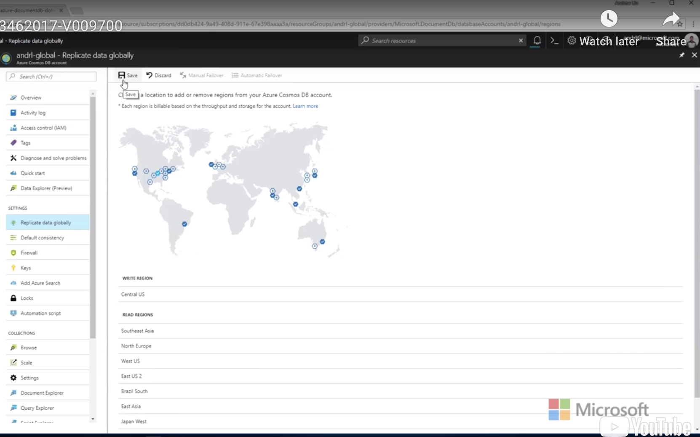

## Introducing Azure Cosmos DB

Azure Cosmos DB is Microsoft's new **globally distributed, multi-model database service**. Azure Cosmos DB offers a turn-key database service that allows you to create a database and distribute the data globally so that the data users access or in datacenters closer to them.

## Azure Cosmos DB APIs

Today, Azure Cosmos DB can be accessed using four different APIs. These APIs will be covered as seperate modules in this course and are listed below for your convenience:

- **DocumentDB (SQL) API**
- **MongoDB API**
- **Graph (Gremlin) API**
- **Tables (Key/Value) API**

## Partitioning

When you create a set of data in Azure Cosmos DB, your data is transparently replicated to ensure high availability. To accomplish this, the Azure Cosmos DB service automatically creates partitions, behind the scenes, and distribute your data across these partitions.

In Azure Cosmos DB, a **partition** is a fixed amount of high-performance storage that contains your data. When your data grows beyond the capacity of a partition, the Azure Cosmos DB service automatically determines the quantity of partitions needed and how to distribute the data across those partitions.

Additionally, you can specify a **partition key** to influence how your data is distributed. A partition key is a JSON path or property that is used by DocumentDB to ensure that related documents are stored in the same parition. This means that documents with the same partition key would be stored within the same partition. This also means that queries within a single partition perform better than queries that cross multiple partitions.

## Global Distribution

When you build applications that have a need to scale to a global audience, you may find yourself spending a large amount of time managing replication and geographic distribution. With, Azure Cosmos DB data is already replicated out of the box in a transparent manner. Azure Cosmos DB also provides configurable options to replicate your data across multiple datacenters.

1. In the Azure Cosmos DB account blade, click the **Replicate data globally** option on the left-hand side of the blade.
2. In the **Replicate data globally** section, select any two locations rendered on the global map.
3. Click the **Save** button to persist these additional locations as **Read regions** for your account.

## Consistency Levels

DocumentDB allows you to specify one of four potential consistency levels per account. A consistency level specified at the database-level is applied automatically to all databases and collections within your account.

The consistency levels range from very strong consistency where reads are guaranteed to be visible across replicas before a write is fully committed across all replicas to a eventual consistency where writes are readable immediately and replicas are eventually consistent with the primary.

| Consistency Level     | Description                                                  |
| --------------------- | ------------------------------------------------------------ |
| **Strong**            | When a write operation is performed on your primary database, the write operation is replicated to the replica instances. The write operation is only committed (and visible) on the primary after it has been committed and confirmed by ALL replicas. |
| **Bounded Stateless** | This level is similar to the **Strong** level with the major difference is that you can configure how stale documents can be within replicas. Staleness refers to the quantity of time (or version count) a replica document can be behind the primary document. |
| **Session**           | This level guarantees that all read and write operations are consistent within a user session. Within the user session, all reads and writes are monotonic and guaranteed to be consistent across primary and replica instances. |
| **Eventual**          | This level is the loosest consistency and essentially commits any write operation against the primary immediately. Replica transactions are asynchronously handle and will eventually (over time) be consistent with the primary. This tier is the most performant as the primary database does not need to wait for replicas to commit to finalize it's transactions. |

### Picking a Consistency Strategy

There are two main things to consider when thinking about your consistency level. First a consistency level on the strong side of the list will ensure that your versions of documents in your replica do not lag behind the primary. If your application requires all replica documents to exactly match the primary at any point in time, this strategy makes a lot of sense. The downside is that the primary write operation will be a lot slower than usual because that operation has to wait for every replica to confirm that the operation has been committed.

A consistency level on the eventual (loose) side will ensure that your database operates at peak efficiency. This occurs because operations against the primary database committ immediately and do not wait for the replicas to confirm that they are committed. This is useful for scenarios where you need the highest tier of performance. The downside here is that there is a potential for any read operations against a replica to be a couple of versions behind the primary and return inconsistent data.

**To Configure:**

To view or modify the default consistency level, sign in to the Azure portal. Find your Azure Cosmos account, and open the **Default consistency** pane. Select the level of consistency you want as the new default, and then select **Save**. The Azure portal also provides a visualization of different consistency levels with music notes.