Above pic. shows that each compute node has a db (a distribution). A control node controlls  all compute nodes. Storage and compute can be scaled independently.

# Distribution Methods and Keys

Azure SQL Data Warehouse uses  60 distributions (buckets) when loading data into the system. Distribution can be based on:

1. Hash Distribution: (say distribution by a Product). A good has should be at least 60 different types (to match 60 distributions)
2. Round Robin Distribution


Each distribution is a sql server database. (1 distribution = 1 sql server db). Each SQL Server Datawarehouse splits into 60 of these distributions.

Compute is increased (scale-out) by increasing DWU units in multiples of 100. Each DWU100 increment means adding 1 additional compute node.

**Example of compute and distribution relationship**:

DWU100 = 1 compute node.  Hence all 60 distributions (dbs) will reside on a single compute node.

DWU200 = 2 compute nodes (pic above). Hence 30 distributions will reside on each compute node.

And so on ...

# Table Type

* Clustered Columnstore: for large tables, organized by columns. Default table type. High compression ratio. Ideally segments of 1M rows. No secondary indexes.
* Heap: meant for temp or smaller tables. No native index, no ordering. Fast load. No compression. Allows secondary indexes.
* Clustered B-Tree Index: most common type, found on on-premise SQL Server. Sorted index on data. Fast singleton lookup . No compression. Allows secondary indexing.


# Distributions


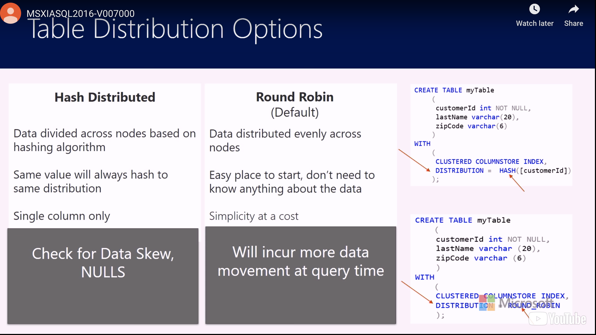

**Hash Distribution**

Hash is a function  where we feed in a number and then it produces an output called the Hash Value. So what's going to happen is when a row gets inserted into the table using that table definition that we created on the far right screen, the value of the column is going to get passed into a Hash function and the Hash value that gets passed returned out is either going to be the same value each time, meaning that it's deterministic or it's going to be non-deterministic, meaning you pass in the same value and you get a different value. *In SQL Data Warehouse,we always have the same value generated. So it's a deterministic Hash function.*

Hash(x) = y


One of the things that is important when you're deciding on a column to Hash
on, is that you select a column that's going to give you an even
distribution of data across those 60 distributions. And this is because the
distributions are assigned to compute nodes and you want to have that
parallel work done in equal chunks, so that each chunk of work that's done
completes at roughly the same time.

You want to avoid hashing on a column that has a lot of null values, because
they will always go into the same bucket and you won't get that even
distribution of data that helps reduce data movement.

**Round Robin Distribution**

Our other distribution option is Round Robin and this is the default
distribution method, if you don't specify one when you creating your table.
The Round Robin distribution method is fairly simple to set up, but because
we're not being strategic about the location of the data across the
distributions, we may end up moving data at query time and data movement is
expensive and it can affect our performance.

**Optimizing Distribution**


1. Optomize For Data Movement
   The most optimized queries on an MPP system can
   just be passed through to an individual distribution or distribution
   database and be executed just in that distribution on their own without
   having to pull data, move data, from other distributions to solve a query.
   That's ideal, we can't always avoid moving data, but when we can make a
   choice about our distribution that affects data movement we want to do that.

2. Optomize For Data Skew
   We also want to minimize data skew and data skew happens when data
   distributions have a disproportionate amount of data relative to the other
   distribution. 

**Movement of Data**

Okay, let's say we have two tables and we distribute them. 

* Scenario 1 : both tables hashed on order id = > (no data movement)

  We distribute one table on order ID, and the other table gets distributed an order ID. Because our hash function is deterministic, we pass in an order ID from table one that gets placed in bucket X. We pass in the product ID to the hash for table two, it's still order ID, that's still going to go in the same bucket. So, then all those same order IDs are in the same distribution or bucket, and when a query is issued that has to look for a specific order ID and it joins like table A table B, Bingo! All that data is in one distribution. So, we don't have to go somewhere else to get more information. 

* Scenario 2:  Table A  is distributed on order ID, table B is just distributed on date =>(data movement)

   So then let's think about another scenario where we have a different distribution for these two tables. So, table A is distributed on order ID, table B is just distributed on date. Now, they will have different hash values, that means they go in different buckets. So, your product IDs, go in a certain bucket, your order ID is going a certain bucket. If you need to join these two tables, maybe you wanted to look at a specific customer ID and  want to look at the orders they placed on a certain date. Now you won't have all the data you need for that customer placed in a single distribution. So, you've got to move data between the distributions in order to or between the compute nodes in order to satisfy that. 

  So, the downside of data movement is that it's slower and it's going to take more resources as well more memory, more compute. 

# Example Round Robin

```sql
IF OBJECT_ID('dbo.OrdersRR', 'U') IS NOT NULL 
   DROP TABLE dbo.OrdersRR;
GO 

CREATE TABLE OrdersRR (
  OrderID int IDENTITY(1, 1) NOT NULL, 
  OrderDate datetime NOT NULL, 
  OrderDescription char(15) DEFAULT ' NewOrdersRR'
) WITH ( CLUSTERED INDEX (OrderID), DISTRIBUTION = ROUND_ROBIN );
```

Code to enter rows of data into the newly created table:

```sql
SET NOCOUNT ON 

DECLARE @i INT 
SET @i = 1 
DECLARE @date DATETIME 
SET @date = dateadd(mi, @i, '2018-01-29') 

WHILE (@i <= 60) 
BEGIN 
   INSERT INTO [OrdersRR] (OrderDate) 
   SELECT @date 

   SET @i = @i + 1;
END		
```

Query which makes use of the SQL DW DMVs to show how data was distributed across the distributions using the round robin distribution method.

```sql
SELECT 
  o.name AS tableName, 
  pnp.pdw_node_id, 
  pnp.distribution_id, 
  pnp.rows 
FROM 
  sys.pdw_nodes_partitions AS pnp 
  JOIN sys.pdw_nodes_tables AS NTables ON pnp.object_id = NTables.object_id 
     AND pnp.pdw_node_id = NTables.pdw_node_id 
  JOIN sys.pdw_table_mappings AS TMap ON NTables.name = TMap.physical_name 
     AND substring(TMap.physical_name, 40, 10) = pnp.distribution_id 
  JOIN sys.objects AS o ON TMap.object_id = o.object_id 
WHERE 
  o.name in ('orders') 
ORDER BY 
  distribution_id			
```

In the results, I can see that the data was distributed somewhat evenly across the 60 distributions.


# Example Hash

Data for the hash distributed table gets distributed across multiple distributions and eventually gets processed by multiple compute nodes in parallel across all the compute nodes. Fact tables or large tables are good candidates for hash distributed tables. You select one of the columns from the table to use as the distribution key column when creating a hash distributed table and then SQL Data Warehouse automatically distributes the rows across all 60 distributions based on distribution key column value.

```sql
CREATE TABLE OrdersH (
  OrderID int IDENTITY(1, 1) NOT NULL, 
  OrderDate datetime NOT NULL, 
  OrderDescription char(15) DEFAULT 'NewOrdersH'
) WITH ( CLUSTERED INDEX (OrderID), DISTRIBUTION = HASH(OrderDate) );
```

Enter rows of data into the newly created table:

```sql
SET NOCOUNT ON 

DECLARE @i INT 
SET @i = 1 
DECLARE @date DATETIME 
SET @date = dateadd(mi, @i, '2017-02-04') 

WHILE (@i <= 60) 
BEGIN 
   INSERT INTO [Orders2] (OrderDate) 
   SELECT @date 

   SET @i = @i + 1;
END 
```

Query which makes use of the SQL DW DMVs to show how data was distributed across the distributions using the hash distribution method.

```sql
SELECT 
  o.name AS tableName, 
  pnp.pdw_node_id, 
  pnp.distribution_id, 
  pnp.rows 
FROM 
  sys.pdw_nodes_partitions AS pnp 
  JOIN sys.pdw_nodes_tables AS NTables ON pnp.object_id = NTables.object_id 
  AND pnp.pdw_node_id = NTables.pdw_node_id 
  JOIN sys.pdw_table_mappings AS TMap ON NTables.name = TMap.physical_name 
  AND substring(TMap.physical_name, 40, 10) = pnp.distribution_id 
  JOIN sys.objects AS o ON TMap.object_id = o.object_id 
WHERE 
  o.name in ('OrdersH')			
```

The query results show that all the rows went into the same distribution because the same date was used for each row and the SQL Data Warehouse hash function is deterministic.


# Relicated Tables

Replicated tables are a tool for avoiding data movement.

Lets review what data movement is first. So the most optimized queries in an MPP system can simply be passed through to execute on individual distributed databases with no interaction between the other databases. But sometimes, data movement is needed between distributions to satisfy the join criteria in a query. 

Replicated tables are a tool that we can use to avoid data movement for small tables. The replicated table has a full copy that's accessible by each compute node. And replicating a table removes the need to transfer data among the compute nodes before a join or an aggregation.

Replicated tables should be small < 2 gas. Replicated tables typically work well for small tables that are dimension tables in a star schema. A dimension table is is something that stores descriptive data that typically changes slowly, so things like customer name, address, or product key.


```sql
CREATE TABLE [dbo].[DimSalesTerritory_REPLICATED] 
WITH ( CLUSTERED COLUMNSTORE INDEX, 
         DISTRIBUTION = REPLICATE ) 
AS 
SELECT * FROM [dbo].[DimSalesTerritory_RR] OPTION (LABEL = 'CTAS : DimSalesTerritory_REPLICATED')
```

Create Statistics


Use the sys.dm_pdw_exec_requests DMV to see query plan containing information about all requests currently or recently active in SQL DW, and the sys.dm_pdw_request_steps DMV, which contains information about all the steps that make up a given request or query.

```sql
SELECT 
   step_index, 
   operation_type
FROM 
   sys.dm_pdw_exec_requests er
   JOIN sys.dm_pdw_request_steps rs ON er.request_id = rs.request_id
WHERE 
   er.[label] = 'STATEMENT:RRTableQuery';
```

**BrodcastMoveOperation**

A BrodcastMoveOperation indicates data movement. And this type of data movement operation will slow down query performance and it can be eliminated by using Replicated Tables.

We will still see  BrodcastMoveOperation the first time that we run a query after we've replicated a table. And this is important to note so that when you do this you don't think something's gone wrong. This is normal. When you replicate a table the first time, it's still going to stay that Round Robin Table. But the process of issuing a query that needs to use that Replicated Table will actually replicate that table across the compute nodes, the first time the query's executed. So this is why we see the Broadcast Move Operation happening the first time but we're not going to see it the second time.

#  Table  Partitioning

In data warehousing, we have to run load processes to put data into the warehouse, and we want those processes to run as efficiently as possible. Table partitioning is a tool that helps us with that efficiency.  Partitioning helps us divide a large table into smaller parts, and those small parts give us the benefits of faster data loading and faster querying. We have the opportunity with partitioning to switch data in and out of our tables to help with our load process. The partitioning is not visible to our end users, so when they query the database, it just appears like it's one logical structure.

A partition is created when you create a table in SQL Data Warehouse, and you specify a partitioning key. It's typically a date. So let's say you want to keep one year of data in a specific table, and you're going to keep that as a rolling year. So when you get to the last month of the year, and your next month is going to start, or let's say you're next month is already started, then you're going to roll out that last month of data.


**Partition Switching , Elimination and Partition Merging**

Some of the benefits that you get in your load process come from this partition switching and partition merging. The main benefit is that a partition switch or merge into an empty table or an empty partition is simply a metadata process. *It's actually not a logged transactio*n. And so, by avoiding transaction logging, you have some benefits over simply deleting data at the table. 

So let's consider an example where you have a table that contains 36 partitions, and you're partitioned on month. So, at the end of 36 months, on your 37th month, you have to archive out to your oldest partition. And so you would have two options in doing this. If you had a non-partition table what you might do is delete that data. So you'd say, 

>  "Delete from table where month equals last 36th oldest month." 

And what would happen is, row by row, the data would be deleted. *It would be fully-logged operation*, and it would also potentially take a long time to rollback the transaction if something went wrong. So, we've got a lot of I/O happening from the log writes. We have a row-by-row operation, which is not optimal for SQL Data Warehouse. 

And then if we compare this to the partition switch, if we just had a partition table, and we were to partition switch the 36th month out of the table, then what happens is that we have an instantaneous operation that isn't logged, and we have some manageability benefits as well.

We also get some benefits to queries. With queries, there's a concept called *partition elimination* that we could take advantage of. 

So, when you have a column listed in your WHERE clause in your query, and it is filtering your data on the same column that you've partitioned your table, what that allows SQL Data Warehouse to do is to not look at the partitions that don't meet that criteria that you're filtering on. That's partition elimination, and it gives us the benefit of having to scan less data and to return results more quickly.


So, if we only look the boundary ranges, let's determine what that means first. So, we start with 2017, and we've got February 5, 2017, then we have February 12, 2017. These are all Sundays. *So I'm partitioning basically on week*. Two 26, three five, three 12, three 19. 

So what does that mean? Well, when we're talking about partitions, we're talking about the boundary or the range of values that fall between for example, February 5th and February 12th of 2017. So, when we have a range right partition, we automatically get a partition to the left of the first values specified. So, any dates that were OrderDates that were inserted into this table that were less than this first boundary value, February 5th of 2017, they'd fall into this first bucket that was first partition. So that would be identified as partition one in metadata in C2 DW. Then our next partition boundary would be between the first and second OrderDate values that we specified. So between anything that's greater than or equal to February 5th of 2017 but less than February 12th of 2017, et cetera as we go down to our last partition. Our last partition is three 19, March 19th of 2017. Anything greater than or equal to that value falls into the final partition. Now, if I count these up we have one, two, three, four, five, six, seven boundary values we specified.  We get the leftmost partition, I guess you could say for free. And so that's identified as partition one, so we get to take the number of boundary values plus one. So N plus one is a number of partitions. We have eight of them. So one, two, three, four, five, six, seven, eight. I'm enumerating all these details because we're going to talk about what falls into which partition as we answer to values. 


60 Distributions

  Each Distribution

​	Has 4 Partitions

​		Each Partition

​			Has Row Groups: to get your best performance, you want to make sure that each row group has 1 			    million rows in it.

Row Groups:  Within each partition, we get 100-million-row row groups for clustered column store. Now I bring this up because you're going to have one or more partitions, but you're going to get a minimum of one. I bring this up because the engineering team, the Microsoft Engineering Team does all this testing, and what they determined was that the sweet spot for cluster column store is 100-million-row row groups. It performs best when you have that many rows in a row group. So to get your best performance, you want to make sure that each row group has 1 million rows in it.

Example: 60 distributions x 4 partitions/distribution x 1 million row group = 240 m rows.  We need a minimum of 240 rows to take advantage of partitions. And it has to be partitioned so at 1 million rows falls to row group.

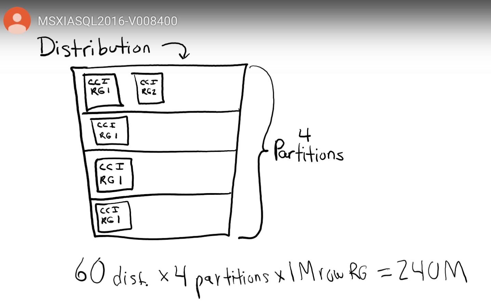


And this is pretty neat as you compare it to SQL Database on-premise because you don't have any partition functions or partition schemes that you have to define separately from the CREATE TABLE statement. So all we do is we specify the partition values and the boundary values and we instantly have our partitions created for our table.

So, if we want to think about what happens when we load data to this table, it's important to think about this because we have distributions, we have clustered columnstore, and we have partitions. 

So, what's going to happen here is we have *60 distributions*, like we've talked about previously in our distribution module. So we have 60 buckets of data, 60 separate Azure SQL Databases. So then our data gets each row that has to get inserted. It gets inserted into one of those buckets. Then within the bucket, we have *five partitions*. For this partition definition, we have four partitions defined and then we have a leftmost partition. That's technically not shown on the slide but we get it by default, so n plus one partitions. 

So that row comes in, it goes into a distribution, and then within each distribution, there are five partitions. And then within each partition, there are *row groups*. A row group is a component of clustered columnstore, and we'll talk more about that in our columnstore module. But we have this hierarchy. 

So what happens is we end up with a distribution, then we have a partition, and then we have a clustered columnstore row group. One of the things that happens is that we have to take advantage of clustered columnstore by grouping our rows into *1 million row groups*. So, within this hierarchy, we need to make sure for partitioning a table that we have at least 1 million rows that meet each partition boundary value that we're setting up. So, we need at least 60 million rows per partition so that we have minimum of 1 million rows per distribution. 

So, if we had the 36-month example, we would need to have 1 million rows per month times 60 million rows per partition, times 1 million rows per row group. And then that comes to 2.1 billion rows. *So when you apply partitioning to a table that has cluster columnstore, you really need to make sure that you're going to have at least 1 million rows per distribution and partition to take advantage of the compression and performance benefits that you get from cluster columnstore.*

**Partition Best Practice**

Best practice is to leave an empty partition at the beginning and at the end of the partition ranges so that we can do what's called a *sliding partition*. A lot of times we're archiving data in and out at the end of a partition based on the amount of data that we want to keep in our warehouse. So, the way we're setting this up, will create an empty partition in the beginning and per best practice.

**Partition Switch**

Now a common thing that we do in Data Warehousing is called a Partition Switch. So, a partition switch happens when we want to either archive off old data or we want to load data into the warehouse. A lot of times this happens from a staging table. So, let's assume a scenario where we're switching out of a production table in a system outside of SQL DW into a SQL DQ table. So, we're going to create the staging table.  Now what we see is that with every table we have a partition one, we get that by default. We didn't create a partition but we automatically get that. There are no rows in that default partition. 

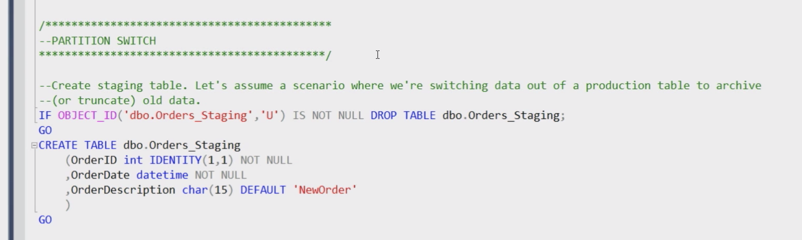

And then, we want to switch data out of partition three, in our orders table where we have eight partitions, into that staging table. So, this is our statement below. Partition 3 will now have 0 rows, and the rows will be moved to dbo.Orders_staging Partition 1 (the default).

Both tables  in switch need to be partitioned similarly.

We switch in when we're loading data from a production system into a warehouse

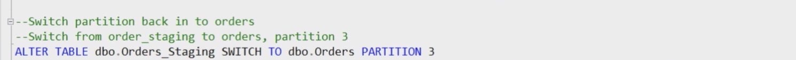

 We Switch out when we want to archive data

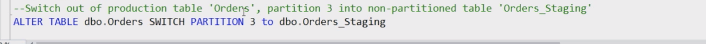

**Take away about partitioning** 

The important thing to take away about partitioning is that, when you switch into an empty table or
an empty partition the data is not moved, there's no logging: it's simply a metadata operation.
We could actually switch millions of rows into a partition and as long as we're not moving any
data, it's a metadata only operation. So, instead of inserting, where it might take hours to load
data, this metadata operation will just take seconds. We switch out when we want to archive data,
and we switch in when we're loading data from a production system into a warehouse.


# Indexes

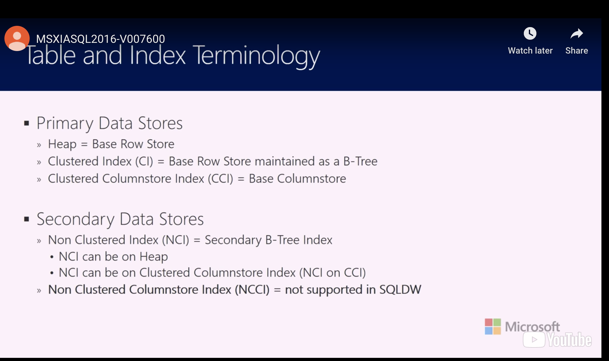

A primary data store, I'm considering something that is the table: A Clustered Index or a Heap is the table. We are able to put a Clustered Rowstore Index, a clustered Columnstore Index or a Heap on a table in Azure SQL Data Warehouse.

 We can also put a non clustered Rowstore index on a table in SQL Data Warehouse, but it's important to note that we don't have Non Clustered Columnstore Indexes available in Azure SQL Data Warehouse. Clustered Columnstore Indexes are the default index.

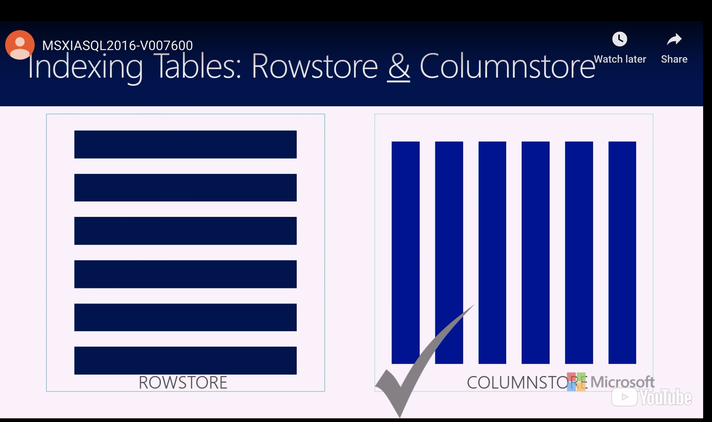

So in a Rowstore Index, we are storing data in rows physically on disk. All of the columns are included in the storage for the Rowstore Index. In a Columnstore Index on the right side of this image, you can envision your data being stored in columns. The  Clustered Columnstore is the default Index. The data in a Columnstore gets highly compressed and it gives us more performance queries, because of the way that the Columnstore is structured.

**Choosing Appropriate Index**

You might wonder though, how do you choose between a Rowstore and a Columnstore index. Well, a Rowstore index typically performs best on queries that seek into the data, that are pulling back a few rows, a singleton row or a small range of data. Typically, if data is frequently updated or if we have small dimension tables in a SQL Data Warehouse, a Rowstore index will be a great candidate. A Clustered Columnstore index by contrast is typically what we use for large data sets.

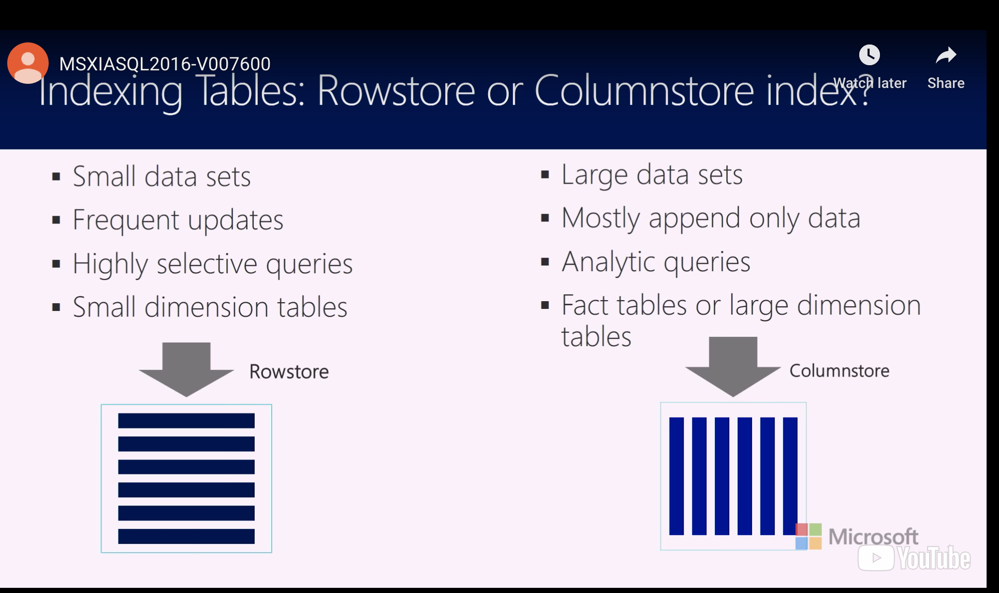

**Syntax For creating a Table with Index**

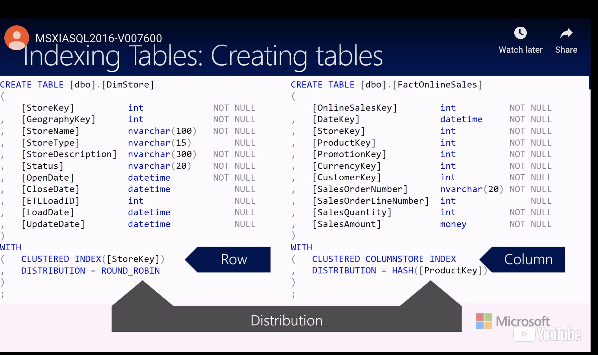

So, one of the main differences here is that we don't specify a clustering key for a Clustered Columnstore index ( because it's clustered it is the table), but it's not stored in an ordered way.

In a Clustered Rowstore index we have to specify one or more columns that are going to be used to test whether the data is physically ordered. In a Clustered Columnstore Index, we don't have to do that because there's a component of a Clustered Columnstore Index called a segment and row groups are divided into segments and each segment has min and max values stored for it. And so that's how a SQL Data Warehouse transverses through the Clustered Columnstore Index to determine where to find data.

A Clustered index may outperform Clustered Columnstore Index when we need to look up a single row or a small range of values.

**Heap**

We can also create a Heap. And a Heap is really a no index option. It's an unordered list of values. It is supported in SQL Data Warehouse, and this might be the best choice for a table that you'd use for loading data.For Example:  loading data to stage it before running transformations might be faster by loading into a Heap versus an index table. 

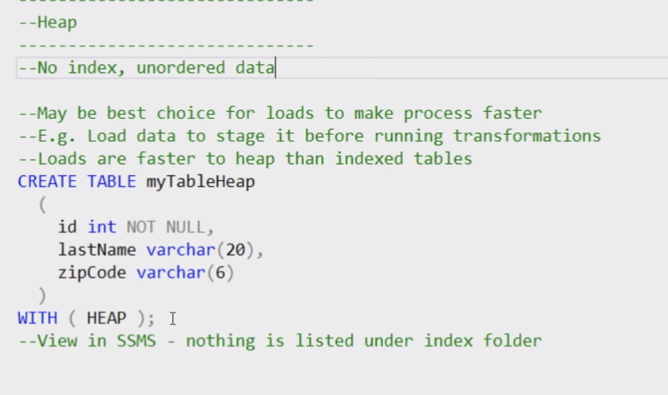


Q:  How would I know when to apply some of those other indexes that you mentioned?

Ans:  So, couple kind of rules of thumb. If you have a large fact table, hundreds of millions of rows, you're typically are going to apply your cluster columns for index. 

But you asked specifically about these row store indexes. So for row store indexes, we're thinking about a row store index when we are *seeking into a set of data to look for a specific row for a range, a small range of rows*. That's when we're going to use a clustered index and non-clustered index, a row store. We need to tell SQL Data Warehouse where specifically to search for the data. You've got all this data so the index says, "This is where this data is located on disk. This is all you need to pull off in order to satisfy the query." You don't want to scan huge ranges of data.

And so if you're putting a column in your filter criteria, your where clause on the key that the index was created on,  your row store index was created on, SQL Data Warehouse can have an easier time finding that row.


# Query Statistics

One of the most critical reasons for poor query performance is that your statistics are out of date.

Statistics are objects that contain information about the distribution of values in one or more columns, or of a table, or indexed view, and they play a pivotal role in database performance. Essentially, statistics tell SQL Server how much data the query is potentially dealing with. The query optimizer uses these statistics to estimate the cardinality or the number of rows in the query result. These estimates are used to create a high-quality query plan by the query optimizer. Now, unlike SQL Server where SQL Server automatically creates statistics, SQL Data Warehouse in creating an updated statistics in SQL's Data Warehouse is currently a manual process meaning, they're not automatically created when you create a table. It's very simple to do, but when you create a table, you must also create the statistics and also keep them up to date.


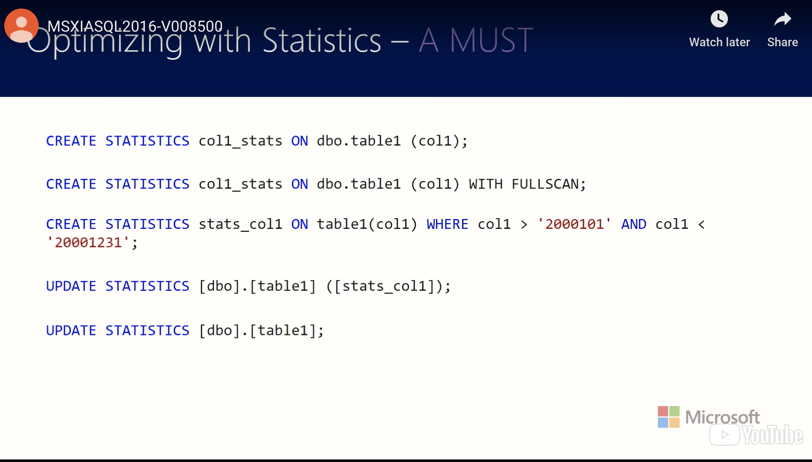

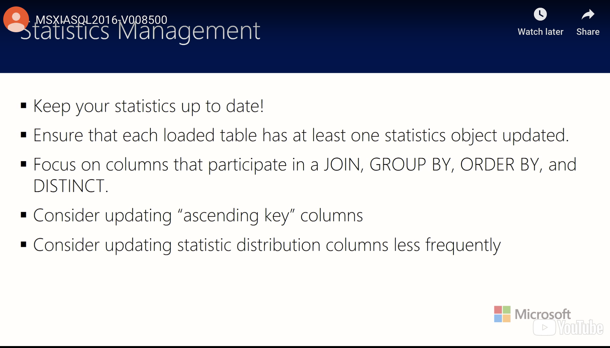


# PolyBase

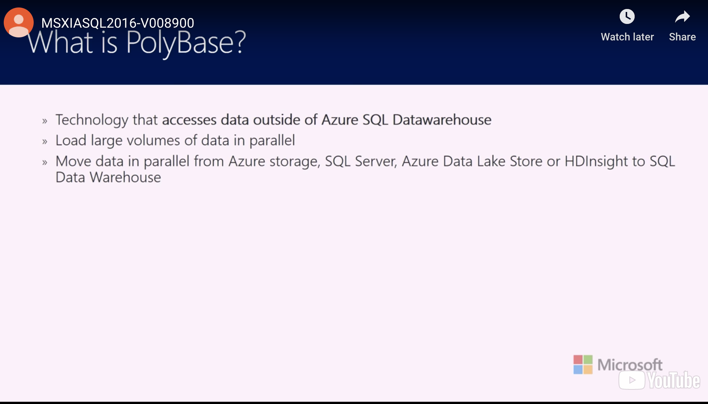

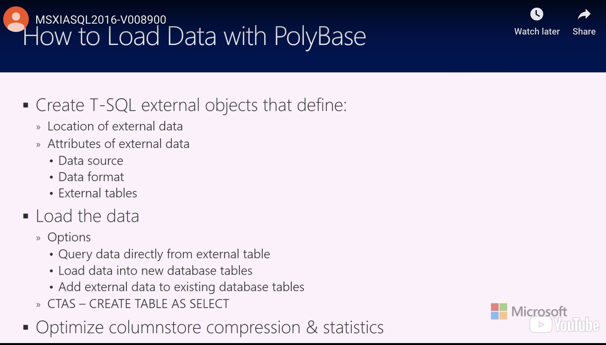


# References

 [eDX Delivering a Data Warehouse in the Cloud](https://courses.edx.org/courses/course-v1:Microsoft+DAT220x+2T2019)