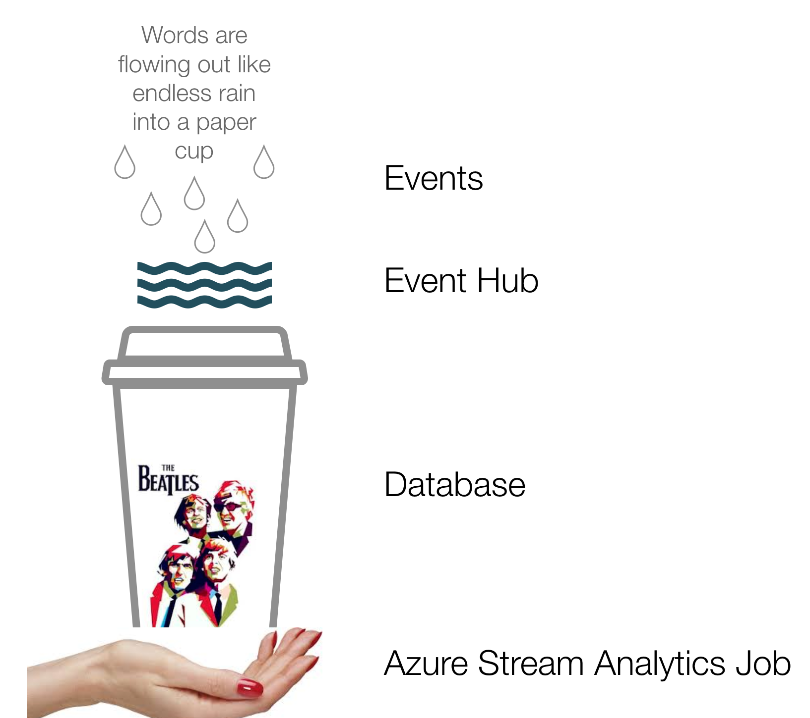

# Introduction

Hello, my name is Hersh Bhasin and welcome to my course, "Processing Real-Time Data Streams with Azure Stream Analytics". I work as a Cloud Architect with xyz company and recently I  have been doing  quite a bit of work in helping transition workflows to a  stream-based architecture.  I'd like to share some of my experience around data streaming with you. 

# Objective

While streaming of data and stream processing is a vast topic and there is a whole world view that goes with it, this course is an introduction to the area.  I want to look at topics like:

1. What are the problems streaming  data is trying to solve? Why do we need something new when we already have storage mediums like databases etc.
2. How does flowing data streams differ from OLTP databases, key value stores, caches etc.
3. As unbounded streams of data flows, how can we listen for data that interests us, and extract such data.

#  Why Streaming?

## Our traditional storage approach locks up data  in tables & schemas 

Most of our typical web or mobile applications are build on a HTTP request/response paradigm. A web application makes a rest call to an api, that api gets the data from a database and returns it back to the application which then displays it in the UI.  Because the data that the application needs is stored away in well know table schemas in a database, a consuming application can efficiently query it with well know syntax . This works great when a known application talks to a known data store. However this also means that data gets locked away in tables and schemas

## Pipeline Sprawl

To extract data from multiple data stores, we need to build data pipelines and this can soon lead to a "pipeline sprawl".

Having a "well-known" data stores means that that data gets locked away in tables and  schemas, and this becomes a drawback when data has to be extracted from multiple stores, say by a offline batch process which needs to extract data from many databases and aggregate it for analytics. This  batch process would need to understand the specific schema of each of these databases,  unlock and open the door of each table as it were, and then perform transformation on the data. You can end up building hundreds of pipelines to extract data that is locked away and interwoven in these databases, caches and search indexes. This is inherently complicated and hard to manage.

# Data Streams

Instead of locking up our data in database tables,  we can think of data as an ever flowing river of events. Our applications and batch processes can subscribe to and listen on the events that flow in this river, and some events can even trigger other events. This emancipation of data is very powerful indeed.

#  What is Azure Stream Analytics?

""Words are flowing out like endless rain into a paper cup..." goes the famous Beatles song and its a good analogy for the paradigm of streaming data. The rain drops are the events our applications generate. These rain drops of events accumulate and flow as a river of data, an analogy to our event hubs. To this river of data we take a tool, our hand, to scoop out a cup of event data. The tool is an Azure Stream Analytics job, and the cup that holds a sampling of data is our database. 

# Tha Data Path

 

* Applications cause events to occur. Maybe it is a sensor reporting the health of a device  every second. We can define an event as a fact about the world. Something happened in the world and the event is a record of it. It is a message with some information, maybe in the Json format. 

* These  events fall like raindrops,  and the accumulated raindrops become a river,  and that river  could be an Event Hub, an IOT Hub or an Azure Blob Location.

* To this river that is the event hub,  we take a  tool, our hand,  to extract data. This tool is our Azure Stream Analytics job.  It bridges the input, say  an  event hub, to an output, say a sql server database, with a sql query. Then as the data come in real time into the river, the query runs against the unbounded stream of data as it arrives, and write out the  data of interest to the output. 

* The output is our paper cup that holds the extracted data.. This cup could be a database or it could be an Azure blob store location, or an Azure data location, or it could be a real time Power BI dashboard.

# Demo