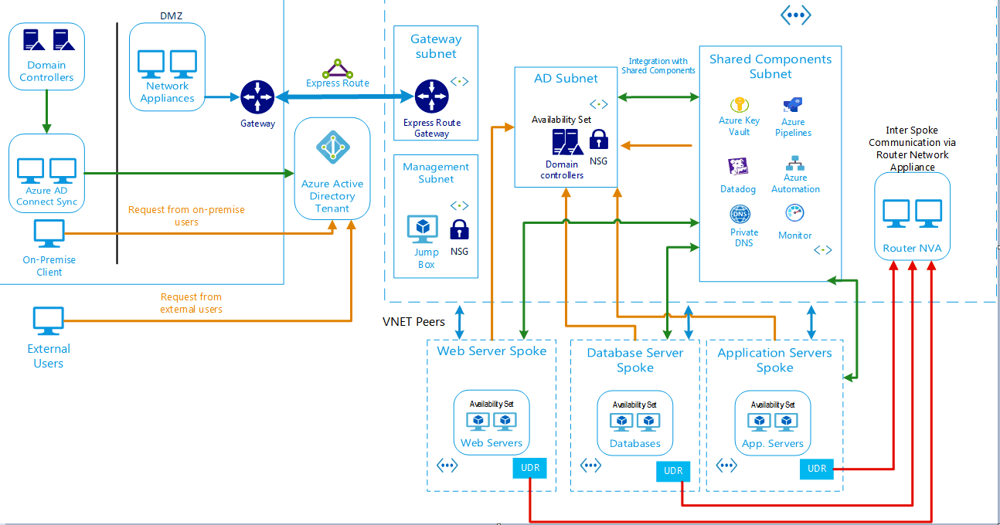
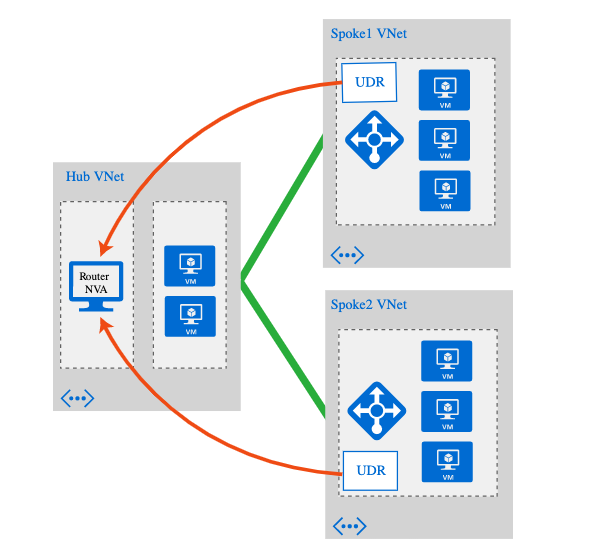
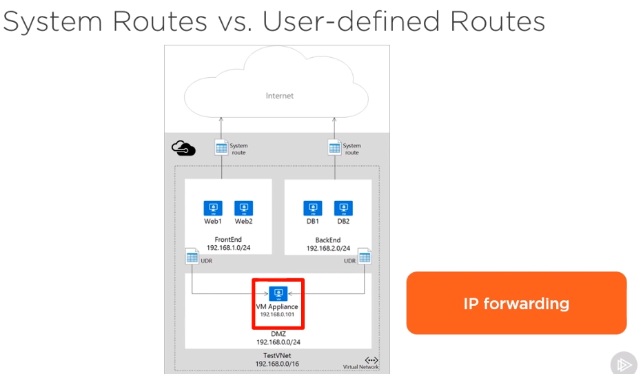
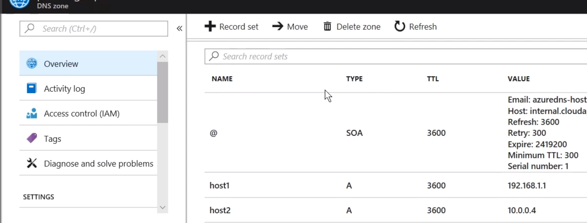

Peerings are not transitive. Hence the pattern is :

1. Hub vpn is connected to to Azure VPN Gateway or Express Route link that goes to  on-prem
2. Then you spoke out vpns from that hub vpn

   


## Core Components

* **On-premises network**. The  private local-area network running within organization.

* **ExpressRoute gateway**. An  ExpresssRoute circuit is used to connect the organization on-premises network to the Hub VNet.

* **Hub VNet**.  An Azure VNet is used as the hub in the hub-spoke topology. The hub is the central point of connectivity to organization on-premises network, and a place to host Platform Components that can be consumed by the different workloads hosted in the spoke VNets. 

* **Spoke VNets**. One or more Azure VNets that are used as spokes in the hub-spoke topology. Spokes can be used to isolate workloads in their own VNets, managed separately from other spokes. Each workload might include multiple tiers, with multiple subnets connected through Azure load balancers. 

* **VNet peering**. Two VNets can be connected using a peering connection. Once peered, the VNets exchange traffic by using the Azure backbone, without the need for a router. In this hub-spoke network topology,  VNet peering is used to connect the hub to each spoke. You can peer virtual networks in the same region, or different regions (Global VNet Peering).

* **Inter Spoke Communication (Routable Subnets)**. The spoke VPNs communicate with each other by forwarding their outbound traffic, using User Defined Routes (UDR) , to a Virtual Network Appliance that resides in the Hub VPN, and the Network Appliance then forwards the traffic to its final destination.

* **Platform Components** **(Shared Services) Subnet**. Platform components reside in the Hub VNet and can be  shared by the spoke VNets. These are  Azure resources like Azure Key Vaults, Azure Pipelines, Data Dog, Azure Automation, Private DNS and Azure Monitors

  

## Security Considerations

* **Extended & Common Identity**. The organization on-premise Active Directory Domain Services (AD DS) environment is extended to Azure using  Azure AD Connect that syncs the on-premise AD DS evviroment to an Azure Active Directory Tenant

* **Hub Vnet Domain Controller for Fine Grained Azure Policy**. For Group Policy Objects that need to be  controlled separately for Azure and organization on-premises environment, there is a Domain Controller in the Hub Vnet.

* **Jump Box**. In case connectivity to the organization on-premise network is lost, the Jump Box, which will be the single point of access, will be used to manage the assets in the subscription.

* **Azure Key Vault**. Is used for storage of protected secrets.

  

## Availability Considerations

* **Domain Controller in Azure Hub Vnet for Outages**. AD Domain Controllers in an  availability set will be deployed to the Azure Hub VNet. This  will treat the Azure VNet as a stand alone site, and in the event that connectivity is lost to the on-premise site, the authentication and authorization will be  local, and will still work.
* **Availability Sets**. Azure Domain Controllers and Network Appliances will be placed in availability sets for high availability.

# VPN Gateway & Local Gateway

1. Virtual Network Gateway is the termination of a network and is placed in a Gateway subnet in the VPN. Has a public ip address
2. An Azure resource: Local network Gateway is also created. This represents the  on premise gateway 
3. In the connections property of the VN Gateway (#1), the Local network gateway (#2) is hooked up.


## Connecting Spokes






1. Normally you don't have to do anything explicit with route tables; Azure handles it automatically with System Routes. Internet calls are also handled automatically
2. You can override System Routes with User Defined Routes (UDR). You would do this when you want your spokes to communicate. You would create UDRs in the spokes to forward traffic to a Virtual Network Appliance that resides in the hub, thus forcing all subnets to put all their outbound traffic through that appliance. This is called *Service Chain*
3. Route tables are bound to subnets
4. On the V N Appliance, you would enable IP Forwarding so that it can pass on traffic that is not destined for it self.

# Private DNS Zones

When VNETs are peered, you can use a Private DNS Zone for name resolution between the vents.

1. Create a Private Zone (powershell required: New-AzureRmDnsZone). If you have a single vnet, it will be a RegisterationVirtualNetwork. For multiple vnets, the first one will be a Registration vnet, the others will be resolution vnets
2. Create host records for each private IP address: Name, RecordType = A, DNSRecords = IP address



Testing Connectivity

```powershell
Test-NetConnection -ComputerName <ipaddress> -Port <port>
```

