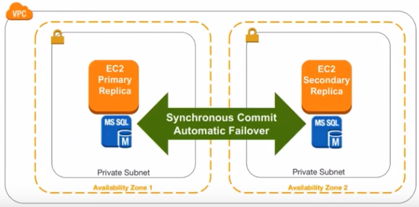
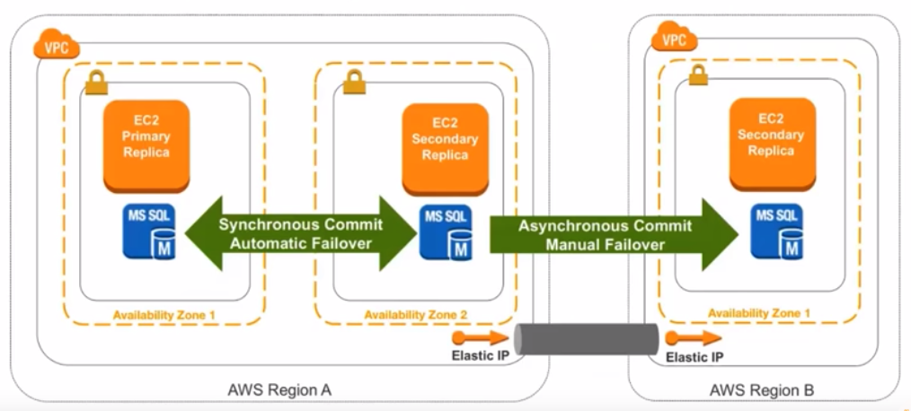
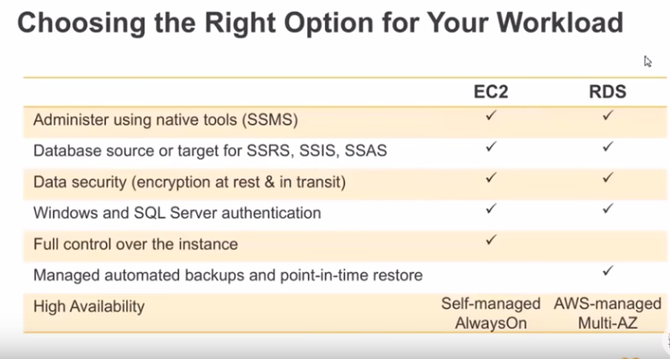

---

layout: post
title: "Microsoft SQL Server In AWS"
author: "Hersh Bhasin"
comments: true
categories: AWS
permalink: /microsoft-sql-server-in-aws/
---

## AWS Options For SQL Server

1. RDS for SQL Server
   * License Included (hourly instance cost includes license cost too)
   * BYOL (bring your own licence)
2. SQL Server on EC2
   * Licence Included
   * BYOL

# SQL Server on EC2

1. When to use SQL Server on EC2 instances

2. When you want to support legacy versions of SQL Server

3. When you want full control over the instance (OS and software stack)

4. When you want to support instance storage: these are direct attached drives, typically SSD based that can be used to deploy high I/O clusters that exceed the capabilities of network block storage provided by Amazon's Elastic Block Storage.

5. When you want multi-data center high availability (see Multi-AZ Always on Availability Group below)

6. When you have Microsoft Software Assurance and bring your own licence, and want to take advantage of passive instance licencing (see Passive Licence below).

   **Considerations**

   1. Need to manage your own backups, maintenance & patching
      Multi- AZ AlwaysOn Availability Group

   

**Multi-AZ AlwaysOn Availability Group**

High Availability/ AlwaysOn: EC2 SQL Server instances located in multiple availability zones (which in turn are backed by multiple physical data centers) are close enough to facilitate  latencies usually between one and two milliseconds but are in different floodplains, power grids etc. for added resiliency. Since latency is not an issue in AWS, synchronous commit across multiple availability zones is very practical and you can do automatic failover across data centers.

**Multi Region AlwaysOn Availability Group**

For high availability, there can be a asynchronous commit, going over a VPN connection between different regions, which allows a manual failover  to an entirely different geographic region. However, such a "hot standby" option is costly.
Such a architecture is mostly for high availability but if our concern is about an entire region becoming unavailable, here are two options for DR:

1.	Option1: Hot standby  for lower Recovery Time Objective and Recovery Point Objective 
2.	Run live in anothe region
3.	Async Commit Transactions (if using SQL Server AlwaysOn)
4.	Option 2: Just-In-Time  DR deployment 
5.	Deploy new farm
6.	Restore data from backups in Azure S3

## Passive License is Free

If you have Microsoft Software Assurance, and bring your own license, a passive instance of SQL Server is free (license Mobility). In such a situation, it is beneficial to use EC2 with BYOL. On the other hand if your SQL Server instances are not running 24/7 (example: ETL tools that run a batch and stop), the RDS SQL Server with license included will be cheaper.
To take advantage of License Mobility, the secondary SQL Server instance must be completely "passive": it cannot be a "Read Replica" or a backup source.

The SQL server ‘passive failover rule’  available under Volume Licensing, would commonly support situations when a primary server suffers a hardware or software failure (or is taken offline for routine maintenance or patch management) and requires the secondary ‘passive’ server to take over completely for ‘temporary’ support, but importantly, without requiring an additional licenses to be assigned to the secondary ‘passive’ server. However, the passive failover server rule will only support a single designated passive server under the allowance for each primary licensed server.

# Amazon RDS For SQL Server

**Salient Features**

1. Managed Service
2. Simple Multi-AZ deployment for high availability: you can deploy a highly available cluster comprised of a principal server and a passive secondary in a different availability zone by choosing the Multi-AZ option at deployment time. Failover is automated: you simply connect your applications to a DNS endpoint instead of a IP address. AWS manages the DNS endpoint on your behalf and changes the DNS entry to reflect the IP address of the principal server in the event of an outage. In the case of an outage of the principal sever, the secondary server is failed over to. The application has to have connection retry logic: once the application detects that the connection has been broken, it should retry until it connects to the new primary server.
3. Supports mixed-mode authentication
4. Encrypted storage regardless of edition
5. Native backup and restore for using backup files (.bak files) integrated with S3: Native backup and restore to S3: you designate a s3 bucket for use with your RDS instance and refer to it when exporting or importing backups.
6. Up to 30 databases per instance

**BYOL SQL Server in Amazon RDS**

1. Submit a Licence Mobility form to Microsoft for verification of your licences

2. Microsoft will verify it to you and to AWS

3. You may deploy your application up to 10 days before submitting the form

4. RDS License Model: choose BYOL instead of Licence Included

   

Database source for SSRD: SQL Server Reporting Services (SSRS) or SQL Server Integration Services (SSIS) cannot be hosted on RDS but a SQL Server instance hosted on either EC2 or RDS can be used as a source or target of data for SSRS or SSIS.

Full Control only in EC2: In RDS you cannot access the file system, or RDP into the instance in RDS, or access the sysadmin role.

Automated backups in RDS: RDS provides automated backups with point in time restore, consistent configuration management via parameter and option groups and automated patching.

Hight availability: in EC2, you manage your own always-on availability group clusters whereas RDS provides a fully managed solution.

## Reference

https://www.youtube.com/watch?v=SubDBU6uyBg